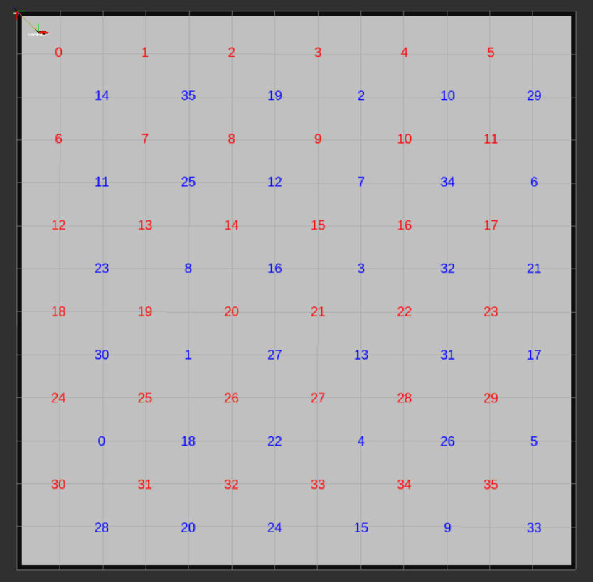

## 2020/2/4 更新
### 【连连看】规则
整个场地表格为 `13 m x 13 m` 的地图，单位格子为 `1 m x 1 m`。



36个红色数字为顺序序列:
```
[0,1,2,3, ..., 34,35]
```
在地图map坐标系下的坐标`(x, y)`为
```
(1+i/6*2, 1+i%6*2), i为顺序序列的序号 
```

36个蓝色数字为的乱序序列
```
[14, 35, 19, 2, 10, 29, 11, 25, 12, 7, 34, 6, 23, 8, 16, 3, 32, 21, 30, 1, 27, 13, 31, 17, 0, 18, 22, 4, 26, 5, 28, 20, 24, 15, 9, 33]
```
在地图map坐标系下的坐标`(x, y)`为
```
(2+j/6*2, 2+j%6*2), j为乱序序列的序号 
```

显然，相邻相同颜色的点间隔为 `2 m`（也就是2个单位格）


学生需要模拟一台机器人从场地上指定位置出发，机器人自由选择并经过红色的数字点，再到达相同数字的蓝色数字点（其间经过的点一律视作无效），则这一组点视为通过。以此类推，机器人遍历场地上 `36` 对点后，任务完成。

学生需要提交录制的完整机器人运动视频。任务完成后，将会输出时间作为最终成绩
> 从触发第一个红色数字开始计时，直到触发最后一个蓝色数字完成36个数字的匹配后停止计时。
### 详细要求
1. 起始启动的指定位置坐标`（x,y）`为 `(0.5, 0.5)`
   
2. 机器人运动最高线速度为 `2m/s`, 最高角速度为 `180°/s`, 最高线加速度为 `2m/(s^2) `, 最高角加速度为 `180°/(s^2) `
   
3. 经过红色数字点和到达蓝色数字点的触发条件为机器人离相应的数字点坐标的欧氏距离小于 `0.15 m`
4. 在Rviz中呈现形式为，经过目标红色数字点后，该点的颜色会变成绿色，到达相同数字的蓝色数字点后，两个配对点消失，至此完成一对点的匹配。

### 新增ROS节点发布的信息
新增了simple_game包，其中包含了比赛规则和评判节点。
该节点会发布两个话题
1. `/blue_numbers`: 描述了蓝色数字乱序序列，消息类型为`std_msgs::Int16MultiArray`
```
layout:
  dim: []
  data_offset: 0
data: [14, 35, 19, 2, 10, 29, 11, 25, 12, 7, 34, 6, 23, 8, 16, 3, 32, 21, 30, 1, 27, 13, 31, 17, 0, 18, 22, 4, 26, 5, 28, 20, 24, 15, 9, 33]
```
2.  `/number_markers`: 描述了红蓝色数字显示在rviz上的状态，消息类型为`visualization_msgs::MarkerArray`
``` 
markers:
  -
    header:
      seq: 0
      stamp:
        secs: 0
        nsecs:         0
      frame_id: "map"
    ns: "red"
    id: 0 // 代表了数字点的序号i，此例为红色数字0
    type: 9
    action: 0
    pose:
      position: // 代表了数字点的坐标，此例为红色数字0的坐标(1.0,1.0)
        x: 1.0 
        y: 1.0
        z: 0.1
      orientation:
        x: 0.0
        y: 0.0
        z: 0.0
        w: 1.0
    scale:
      x: 0.0
      y: 0.0
      z: 0.4
    color: // 代表了数字点的颜色rgb和不透明度a，a为0时则代表两个点已经匹配完成即为透明，此例为蓝色数字0的颜色为红色，不透明
      r: 1.0
      g: 0.0
      b: 0.0
      a: 1.0
    lifetime:
      secs: 0
      nsecs:         0
    frame_locked: False
    points: []
    colors: []
    text: "0" //代表数字点的数字
    mesh_resource: ''
    mesh_use_embedded_materials: False
  -
  （省略剩余35个红色数字点）
  -
    header:
      seq: 0
      stamp:
        secs: 0
        nsecs:         0
      frame_id: "map"
    ns: "blue"
    id: 36 // 代表了数字点的序号i，此例为蓝色数字0
    type: 9
    action: 0
    pose:
      position: // 代表了数字点的坐标，此例为蓝色数字0的坐标（10.0,2.0）
        x: 10.0
        y: 2.0
        z: 0.1
      orientation:
        x: 0.0
        y: 0.0
        z: 0.0
        w: 1.0
    scale:
      x: 0.0
      y: 0.0
      z: 0.4
    color: // 代表了数字点的颜色rgb和不透明度a，a为0时则代表两个点已经匹配完成即为透明，此例为蓝色数字0的颜色为蓝色，不透明
      r: 0.0
      g: 0.0
      b: 1.0
      a: 1.0
    lifetime:
      secs: 0
      nsecs:         0
    frame_locked: False
    points: []
    colors: []
    text: "0"
    mesh_resource: ''
    mesh_use_embedded_materials: False
  -
  （省略剩余35个蓝色数字点）
  -
```
> 注意：该话题表示了72个数字序列的状态，序列的序号`i`在 `0-35` 表示红色数字 `i` 的状态，在 `36-71` 表示蓝色数字 `i-36`的状态
### 测试
#### 方法1： 启动模拟器等其他节点后，启动game节点
``` bash
...启动其他节点
rosrun simple_game game
```
#### 方法2：启动集成好的launch文件
``` bash
roslaunch simple_bringup game.launch
```